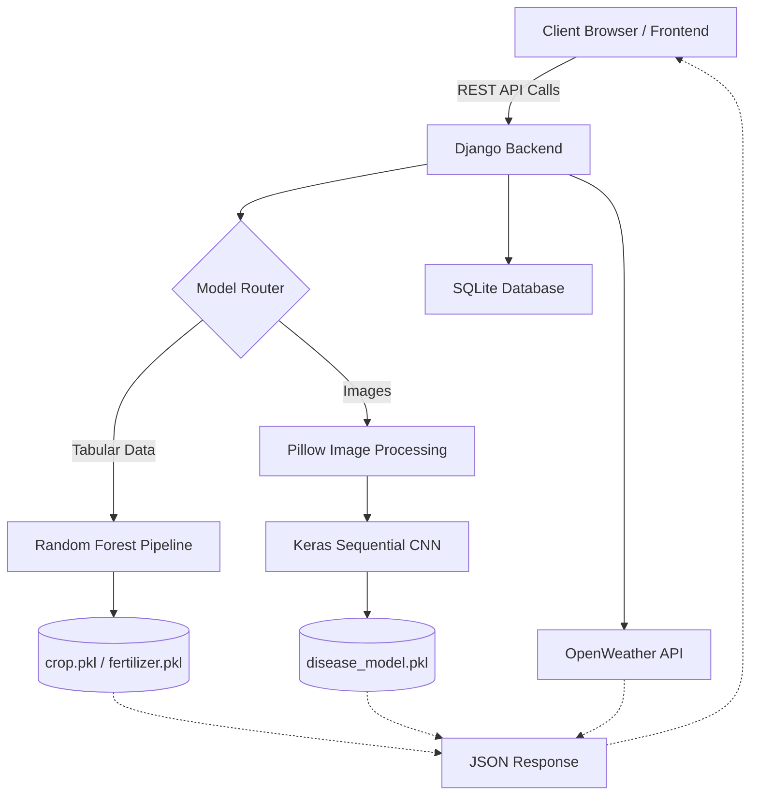
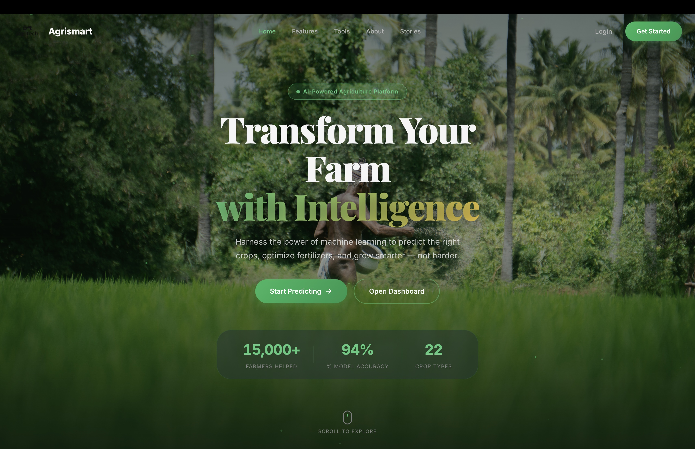
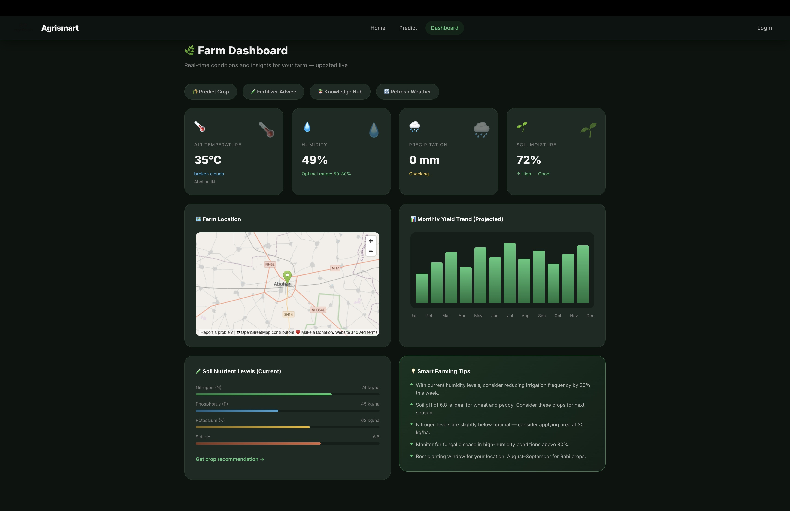
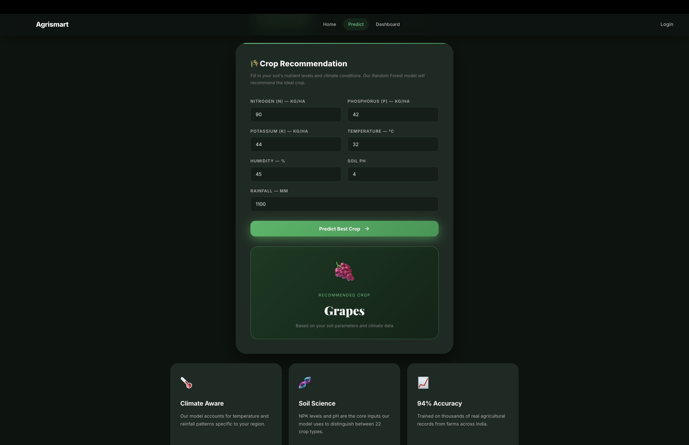
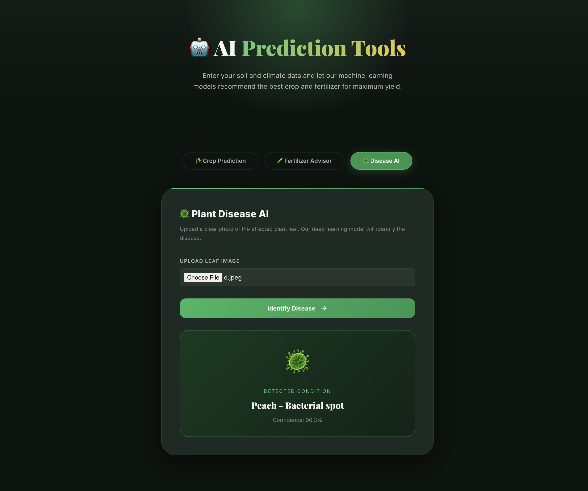

<div align="center">

# 🌾 Agrismart AI

### The Smart Agriculture & Precision Farming Platform

*A deep-learning powered platform delivering predictive crop modeling, intelligent fertilizer optimization, and real-time disease detection for modern agriculture.*

<br>

<p align="center">


</p>

</div>

---

## 📑 Table of Contents

- [Overview](#-overview)
- [Problem Statement](#-problem-statement)
- [Key Features](#-key-features)
- [System Architecture](#-system-architecture)
- [Screenshots](#-screenshots)
- [API Endpoints](#-api-endpoints)
- [Tech Stack](#-tech-stack)
- [Installation](#-installation)
- [Project Structure](#-project-structure)
- [Contributing](#-contributing)
- [Author](#-author)

---

## 📖 Overview

Agrismart AI is an **intelligent precision agriculture platform** designed to maximize yield and minimize resource waste. By combining classical machine learning (Random Forests) with deep neural networks (CNNs), it automates critical farming decisions:

1. **Crop Suitability Predictions** based on real-time soil and climate data.
2. **Dynamic Fertilizer Optimization** ensuring sustainable soil health.
3. **Instant Plant Disease Diagnosis** using state-of-the-art computer vision.
4. **Real-time Weather & Geolocation** intelligence for localized decision making.
5. **Interactive 3D Visualizations** and modern glassmorphic dashboards.

Built with a **headless Django REST API** architecture and a completely decoupled **Vanilla JS + Three.js frontend**.

---

## 🎯 Problem Statement

Smallholder farmers and modern agricultural enterprises face challenges such as:
- Suboptimal crop rotation leading to nutrient depletion.
- Over-application of chemical fertilizers causing soil degradation.
- Delayed identification of plant diseases resulting in massive yield loss.

**Agrismart AI** solves these issues by putting enterprise-grade machine learning models into a lightweight, accessible, and beautifully designed web application.

---

## ✨ Key Features

### 🌱 Predictive Modeling (Crop & Soil)
- **Random Forest classifiers** trained on comprehensive agricultural datasets.
- Recommends the ideal crop among 22 varieties with 94%+ accuracy.

### 🧪 Smart Fertilizer Advisor
- Recommends exact nutrient corrections based on current N-P-K levels and soil pH.
- Integrates crop type, moisture, and temperature.

### 🦠 Deep Learning Disease Detection
- **Convolutional Neural Network (Keras)** trained on the PlantVillage dataset (38 classes).
- Image upload interface with instant confidence scoring and disease identification.

### 📈 Live Farm Dashboard
- Real-time weather integration via OpenWeatherMap.
- OpenStreetMap geospatial tracking.
- Interactive monthly yield trend visualizations.

---

## 🏗️ System Architecture



---

## 📸 Screenshots

### 🌟 Interactive 3D Hero Section


### 📊 Real-Time Analytics Dashboard


### 🌾 Crop Prediction & Fertilizer Advice


### 🦠 AI Plant Disease Identification


---

## 🌐 API Endpoints

All endpoints are prefixed with `/Agri/api/`.

| Method | Endpoint | Description |
|--------|----------|-------------|
| POST | `/login/` | Authenticate and create session |
| POST | `/register/` | Register a new farmer account |
| POST | `/predict/crop/` | Get ML crop recommendation via JSON |
| POST | `/predict/fertilizer/` | Get fertilizer advice via JSON |
| POST | `/predict/disease/` | Upload leaf image (`multipart/form-data`) for CNN analysis |
| GET  | `/weather-key/` | Securely fetch the OpenWeatherMap API key |

---

## 🚀 Tech Stack

| Category | Technologies |
|----------|--------------|
| Language | Python 3.12, JavaScript (ES6+) |
| Backend | Django 5.0 |
| Machine Learning | scikit-learn, joblib |
| Deep Learning | Keras, TensorFlow, Pillow |
| Database | SQLite3 |
| 3D Engine | Three.js |
| UI/UX | Vanilla HTML/CSS, Glassmorphism Design |

---

## ⚙️ Installation

```bash
# 1. Clone the repository
git clone https://github.com/asr09122/agrismart.git
cd agrismart

# 2. Create and activate a virtual environment
python3 -m venv .venv
source .venv/bin/activate

# 3. Install dependencies
pip install -r requirements.txt
pip install Pillow  # Required for deep learning image processing

# 4. Run database migrations
python manage.py migrate

# 5. Start the Django Server (Serving both API and Frontend)
python manage.py runserver 8000
```

**Open your browser and navigate to:** [http://127.0.0.1:8000](http://127.0.0.1:8000)

---

## 📂 Project Structure

```text
agrismart/
├─ app/                       # Main Django project configuration
├─ Agrismart/                 # Backend API App
│   ├─ api_views.py           # REST endpoints (Crop, Fertilizer, Disease)
│   ├─ models/                # Pre-trained ML & DL models (.pkl)
│   └─ urls.py                # API routing
├─ frontend/                  # Completely decoupled static frontend
│   ├─ index.html             # Landing page
│   ├─ dashboard.html         # Analytics dashboard
│   ├─ predict.html           # ML/DL prediction interfaces
│   ├─ login.html             # Authentication
│   ├─ css/                   # Global design system
│   ├─ js/                    # Main logic and Three.js scenes
│   └─ images/                # Static image assets
├─ assets/                    # README documentation images
└─ README.md                  # This file
```

---

## 🤝 Contributing

Contributions are what make the open source community such an amazing place to learn, inspire, and create. Any contributions you make are **greatly appreciated**.

1. Fork the Project
2. Create your Feature Branch (`git checkout -b feature/AmazingFeature`)
3. Commit your Changes (`git commit -m 'Add some AmazingFeature'`)
4. Push to the Branch (`git push origin feature/AmazingFeature`)
5. Open a Pull Request

---

## 👨‍💻 Author

### Abhayjot Singh

Building intelligent solutions at the intersection of AI, Deep Learning, and Full-Stack Engineering.

---

## ⭐ Support

If you found this project helpful, please give it a ⭐ on GitHub!

---

<div align="center">
Made with ❤️ using Django, Keras, and Three.js.
</div>
